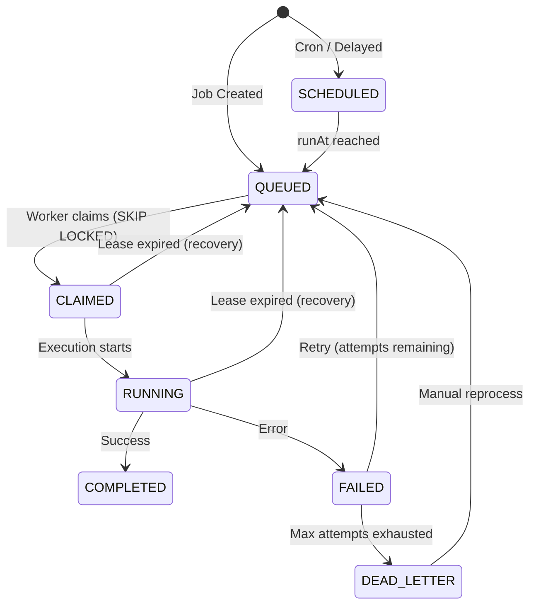

# Distributed Job Scheduler

A background job scheduling and execution platform designed to reliably process asynchronous workloads across multiple worker processes. The system uses PostgreSQL as its authoritative job store with atomic claiming via `SELECT ... FOR UPDATE SKIP LOCKED`, cryptographic lease fencing to prevent split-brain mutations, and automatic recovery of jobs orphaned by crashed workers.

## Overview

The platform consists of four independently deployable services:

- **API Service** — Express.js REST API and Socket.IO WebSocket gateway for job submission, queue management, and real-time event streaming.
- **Worker Fleet** — One or more worker processes that atomically claim jobs from PostgreSQL using row-level locking, execute them within bounded concurrency pools, and maintain lease heartbeats.
- **Scheduler Daemon** — Evaluates recurring cron schedules, promotes delayed jobs, and sweeps expired leases from crashed workers.
- **Dashboard** — React single-page application providing job inspection, queue monitoring, and operational tooling.

PostgreSQL serves as the single source of truth for all job state. Redis is used only for ephemeral coordination: WebSocket event broadcasting via Pub/Sub and optional worker heartbeat caching.

---

## Engineering Focus

This project addresses distributed-systems problems beyond typical CRUD applications:

- **Atomic job claiming** — Workers compete for jobs using `SELECT ... FOR UPDATE SKIP LOCKED`, eliminating double-execution without deadlocking.
- **Queue-level concurrency control** — Each queue enforces a configurable concurrency ceiling, computed atomically in the claim query's CTE.
- **Lease fencing** — Every claim generates a unique `leaseToken`. All subsequent mutations require the token, preventing stale workers from corrupting state after lease reassignment.
- **Heartbeat-based failure detection** — Workers periodically extend their leases. The scheduler sweeps jobs whose leases have expired without a heartbeat renewal.
- **Crash recovery** — Orphaned jobs are automatically returned to `QUEUED` status and made available for other workers.
- **Retry strategies with jitter** — Fixed, linear, and exponential backoff with configurable full jitter to prevent thundering-herd retry storms.
- **Dead Letter Queue** — Jobs that exhaust their retry budget are archived with full execution history for post-mortem analysis and manual reprocessing.
- **Immutable execution history** — Each attempt produces a separate `JobExecution` record. No execution trace is ever overwritten.
- **Idempotency enforcement** — PostgreSQL partial unique index on `(project_id, idempotency_key) WHERE idempotency_key IS NOT NULL` prevents duplicate job creation at the database level.

---

## Reliability Verification

The following scenarios are verified by automated tests in the repository:

| Scenario | Verification |
| :--- | :--- |
| Concurrent job claiming | 50 simulated workers processing 1,000 jobs |
| Duplicate claims | 0 observed across all concurrent workers |
| Queue concurrency limits | Enforced in atomic SQL CTE during claim |
| Lease fencing | Stale worker mutation rejected (0 rows updated) |
| Crash recovery | Expired leases reclaimed by scheduler sweep |
| Retry backoff | Fixed, linear, exponential with full jitter verified |
| State machine transitions | All valid/invalid transitions tested |
| Cron schedule evaluation | 5-field cron parsing and next-run computation |
| Failure categorization | Deterministic heuristic classification of error patterns |

---

## Architecture

```
┌──────────────────────────────────────────┐
│          React Dashboard (Vite)          │
│        http://localhost:5173             │
└──────────────────┬───────────────────────┘
                   │ REST / WebSocket
                   v
┌──────────────────────────────────────────┐
│        Express.js API Gateway            │
│        http://localhost:3000             │
└──────────┬───────────────────┬───────────┘
           │                   │
           v                   v
┌─────────────────┐   ┌───────────────────┐
│  PostgreSQL 16  │   │   Redis 7         │
│  (Job Store)    │   │   (Pub/Sub only)  │
└────────┬────────┘   └───────────────────┘
         │
    ┌────┴────┐
    │         │
    v         v
┌────────┐  ┌──────────┐
│ Worker │  │ Scheduler│
│ Fleet  │  │ Daemon   │
└────────┘  └──────────┘
```

**PostgreSQL** holds all persistent state: jobs, queues, executions, workers, schedules, and dead-letter entries. It is the only component whose failure would result in data loss.

**Redis** distributes WebSocket events across API instances and optionally caches worker heartbeat timestamps. If Redis is unavailable, the core job lifecycle (creation, claiming, execution, completion, retry, recovery) continues operating through PostgreSQL alone.

**Workers** poll PostgreSQL directly. They do not depend on a message broker. Each worker maintains a bounded concurrency pool and uses `AbortController` watchdogs to enforce per-job timeouts.

**The Scheduler** runs as a separate process. It evaluates cron expressions to promote recurring jobs, advances delayed jobs whose `runAt` time has passed, and recovers jobs stuck in `CLAIMED` or `RUNNING` past their `leaseUntil` timestamp.

---

## Job Lifecycle



### Normal path

A job is created via the API and enters `QUEUED` status. A worker atomically claims it using `SELECT ... FOR UPDATE SKIP LOCKED`, transitioning it to `CLAIMED` with a lease token and expiry timestamp. The worker starts execution (`RUNNING`), periodically renewing the lease via heartbeats. On success, the job moves to `COMPLETED`.

### Failure and retry

If execution fails, the job transitions to `FAILED`. If retry attempts remain, the retry calculator computes a backoff delay and the job returns to `QUEUED` with a future `runAt`. If all attempts are exhausted, the job is archived to `DEAD_LETTER` with its complete execution history.

### Crash recovery

If a worker crashes or becomes unresponsive, its heartbeats stop and leases expire. The scheduler daemon periodically sweeps for jobs past their `leaseUntil` timestamp and returns them to `QUEUED` for another worker to claim.

---

## Atomic Claiming

Workers claim jobs using a single PostgreSQL query that combines a CTE for concurrency checking with `FOR UPDATE SKIP LOCKED`:

```sql
WITH active_count AS (
  SELECT COUNT(*)::int AS active
  FROM jobs
  WHERE queue_id = $1 AND status IN ('CLAIMED', 'RUNNING')
),
eligible_jobs AS (
  SELECT j.id
  FROM jobs j, slots_available sa
  WHERE j.queue_id = $1
    AND j.status = 'QUEUED'
    AND j.run_at <= NOW()
  ORDER BY j.priority DESC, j.run_at ASC
  FOR UPDATE SKIP LOCKED
  LIMIT ...
)
UPDATE jobs SET status = 'CLAIMED',
  lease_token = gen_random_uuid()::text,
  lease_until = NOW() + interval '...',
  ...
FROM eligible_jobs WHERE j.id = eligible_jobs.id
RETURNING j.*;
```

`SKIP LOCKED` causes each worker's transaction to skip rows already locked by other concurrent workers, rather than blocking. This eliminates deadlocks and allows multiple workers to claim jobs simultaneously without contention.

The queue's concurrency limit is enforced within the CTE by counting active (`CLAIMED` + `RUNNING`) jobs and capping the number of newly claimable slots.

---

## Lease Fencing

Every claim generates a cryptographically unique `leaseToken` (UUID v4). All worker operations — `completeJob`, `failJob`, `renewLease`, `timeoutJob` — include `WHERE lease_token = $token` in their update conditions.

This prevents the following scenario:

1. Worker A claims a job and receives `leaseToken = abc`.
2. Worker A experiences a GC pause or network partition. Its lease expires.
3. The scheduler returns the job to `QUEUED`.
4. Worker B claims the same job and receives `leaseToken = xyz`.
5. Worker A resumes and attempts to mark the job as completed with `leaseToken = abc`.
6. The update matches 0 rows because the current token is `xyz`. Worker A's stale write is silently rejected.

This fencing mechanism prevents split-brain state corruption without requiring distributed consensus.

---

## Retries and Dead Letter Queue

The retry system supports three backoff strategies, all with optional full jitter:

| Strategy | Delay formula |
| :--- | :--- |
| Fixed | `initialDelayMs` |
| Linear | `initialDelayMs × attempt` |
| Exponential | `initialDelayMs × multiplier^(attempt-1)` |

When jitter is enabled, the computed delay is randomized within `[0.5 × delay, delay]` to prevent multiple retrying jobs from synchronizing their retry times.

Each execution attempt creates a separate `JobExecution` record containing start time, duration, worker ID, error message, and stack trace. The complete attempt history is preserved regardless of outcome.

Jobs that exhaust `maxAttempts` are moved to the Dead Letter Queue with their full execution chain. DLQ entries can be manually inspected and reprocessed through the API or dashboard.

---

## Operational Tooling

### Chaos Engineering Console

An in-application fault injection interface for testing the system's recovery behavior:

- **Simulate lease expiration** — Backdates a job's `leaseUntil` to force the scheduler's recovery sweep to reclaim it.
- **Simulate worker crash** — Marks a worker as `DEAD`, causing its in-flight job leases to expire naturally.
- **Force job failure** — Injects an artificial error into a running job to observe retry and DLQ transitions.
- **Trigger recovery sweep** — Manually invokes the scheduler's lease recovery loop.

All chaos actions are recorded in an audit timeline. This tooling demonstrates that the system correctly handles the failure scenarios it was designed for.

### Failure Investigator

A deterministic diagnostic engine that categorizes job failures by parsing error messages, stack traces, and execution logs. It identifies patterns such as `TIMEOUT_DEADLINE`, `RATE_LIMIT_429`, `DATABASE_LOCK_TIMEOUT`, `UPSTREAM_5XX`, and `RESOURCE_EXHAUSTION`, then produces actionable remediation recommendations.

The investigator is strictly read-only — it cannot mutate job state.

### Queue Load Simulator

Generates synthetic load bursts (1–500 jobs) with configurable priority distributions and failure rates. Useful for observing queue backlog growth, worker throughput, and concurrency limit enforcement under load.

---

## Repository Structure

```
distributed-job-scheduler/
├── apps/
│   ├── api/              # Express.js REST API + Socket.IO (JavaScript)
│   ├── worker/           # Worker daemon with atomic claiming (TypeScript)
│   ├── scheduler/        # Cron evaluator + lease recovery daemon (TypeScript)
│   └── dashboard/        # React 18 + Vite + Tailwind dashboard (TypeScript)
├── packages/
│   ├── database/         # Prisma ORM, raw SQL repositories, migrations
│   ├── shared/           # Retry calculator, cron helpers, structured logger
│   └── types/            # Domain enums, DTOs, and type contracts
├── tests/
│   ├── unit/             # State machine, retry, cron, investigator tests
│   ├── integration/      # Lease fencing, recovery, chaos, API flow tests
│   └── concurrency/      # 50-worker / 1,000-job stress test
├── docs/                 # Architecture, schema, ER diagram, API reference
├── docker/               # Dockerfiles and PostgreSQL init scripts
└── docker-compose.yml    # Full-stack orchestration
```

---

## Quick Start

### Prerequisites

- Node.js 18+ (developed on Node 22)
- Docker and Docker Compose (for PostgreSQL and Redis)
- npm (included with Node.js)

### 1. Clone and install

```bash
git clone https://github.com/dsagar12/distributed-job-scheduler.git
cd distributed-job-scheduler
npm install
```

### 2. Configure environment

```bash
cp .env.example .env
```

Review `.env` and adjust database credentials if needed. Defaults work with the provided Docker Compose setup.

### 3. Start infrastructure

```bash
docker compose up -d
```

This starts PostgreSQL 16 and Redis 7 with health checks.

### 4. Run database migrations

```bash
npm run db:generate
npm run db:migrate
```

### 5. Start services

Open separate terminals for each service:

```bash
# Terminal 1 — API server (port 3000)
npm run dev:api

# Terminal 2 — Dashboard (port 5173)
npm run dev:dashboard

# Terminal 3 — Worker node
npm run dev:worker

# Terminal 4 — Scheduler daemon
npm run dev:scheduler
```

### 6. Access the application

| Service | URL |
| :--- | :--- |
| Dashboard | `http://localhost:5173` |
| REST API | `http://localhost:3000/api/v1` |
| Swagger Docs | `http://localhost:3000/api/docs` |
| Health Check | `http://localhost:3000/api/v1/health` |

---

## API

The API is served at `http://localhost:3000/api/v1` with interactive Swagger documentation at `/api/docs`.

Authentication uses JWT bearer tokens. Requests can also use project API keys via the `x-api-key` header. Multi-tenant isolation is enforced through `x-organization-id` and `x-project-id` headers.

Major resource groups:

| Resource | Operations |
| :--- | :--- |
| `/auth` | Register, login, token refresh, profile |
| `/queues` | CRUD, pause/resume, per-queue metrics |
| `/jobs` | Create, list (filtered/paginated), cancel, reprocess |
| `/batches` | Create and track batch job groups |
| `/schedules` | Recurring cron job management |
| `/workers` | Worker fleet status and heartbeats |
| `/dlq` | Dead letter inspection, reprocessing, resolution |
| `/metrics` | System overview, timeline, per-queue breakdowns |
| `/chaos` | Fault injection and recovery testing |
| `/simulator` | Synthetic load generation |
| `/investigator` | Failure analysis and diagnostics |

Full endpoint documentation: [docs/API.md](docs/API.md)

---

## Testing

### Unit Tests

```bash
npm run test:unit
```

4 test suites, 27 tests covering:
- Job state machine transition validation
- Retry delay calculation (fixed, linear, exponential, jitter)
- Cron expression parsing and next-run computation
- Failure investigator pattern classification

### Integration Tests

```bash
npm run test:integration
```

4 test suites, 22 tests covering:
- Lease fencing token verification
- Crash recovery and lease expiry handling
- Batch job creation and API flow
- Chaos engineering operations and simulator load injection

### Concurrency Stress Test

```bash
npm run test:concurrency
```

1 test simulating 50 concurrent workers claiming 1,000 jobs:
- Verifies zero duplicate claims across all workers
- Confirms queue concurrency limits are respected under contention
- Validates that all jobs are claimed exactly once

### Full suite

```bash
npm run test:unit && npm run test:integration && npm run test:concurrency
```

All 50 tests pass.

---

## Documentation

| Document | Description |
| :--- | :--- |
| [architecture.md](docs/architecture.md) | System architecture and subsystem responsibilities |
| [DATABASE_DESIGN.md](docs/DATABASE_DESIGN.md) | PostgreSQL schema, indexing strategy, and claim query |
| [ER_DIAGRAM.md](docs/ER_DIAGRAM.md) | Entity relationship diagram (Mermaid) |
| [DESIGN_DECISIONS.md](docs/DESIGN_DECISIONS.md) | Engineering trade-offs and rationale |
| [API.md](docs/API.md) | REST and WebSocket endpoint reference |
| [WORKER_RELIABILITY.md](docs/WORKER_RELIABILITY.md) | Worker lifecycle, leasing, and recovery |
| [DIFFERENTIATORS.md](docs/DIFFERENTIATORS.md) | Operational tooling details |
| [DEPLOYMENT.md](docs/DEPLOYMENT.md) | Docker deployment and topology |
| [JOB_STATE_MACHINE.md](docs/JOB_STATE_MACHINE.md) | State transition rules |
| [TESTING.md](docs/TESTING.md) | Test strategy and coverage |
| [SUBMISSION_CHECKLIST.md](docs/SUBMISSION_CHECKLIST.md) | Verification checklist with evidence |

---

## Engineering Trade-offs

**PostgreSQL over Redis as the job store.** Redis offers lower latency but PostgreSQL provides ACID transactions, relational integrity (foreign keys with `ON DELETE RESTRICT`), and durable state that survives process restarts. The atomic claim query (`SELECT ... FOR UPDATE SKIP LOCKED`) eliminates the primary performance concern.

**`SKIP LOCKED` over an external message broker.** Using PostgreSQL directly avoids introducing RabbitMQ or Kafka as additional infrastructure dependencies. `SKIP LOCKED` provides contention-free claiming with queue-level concurrency control in a single SQL statement.

**Lease fencing over distributed locks.** Rather than coordinating workers with a distributed lock service, each job carries its own fencing token. Workers that lose their lease are passively rejected on their next write attempt, requiring no inter-worker communication.

**Separate worker and scheduler processes.** The scheduler runs independently from workers to avoid coupling cron evaluation and recovery sweeps to worker concurrency pools. Either can be scaled or restarted independently.

**PostgreSQL partial unique index for idempotency.** The index `(project_id, idempotency_key) WHERE idempotency_key IS NOT NULL` allows unlimited jobs without idempotency keys while enforcing uniqueness for those that have one, without application-level race conditions.

Detailed discussion: [docs/DESIGN_DECISIONS.md](docs/DESIGN_DECISIONS.md)

---

## Security and Configuration

- **Environment variables** — All secrets (database credentials, JWT signing keys, Redis passwords) are configured via `.env` files. The `.env` file is listed in `.gitignore` and is not committed. `.env.example` provides a documented template.
- **Authentication** — JWT access tokens (configurable expiry) with rotating refresh tokens hashed via SHA-256 before storage.
- **Password hashing** — bcrypt with configurable salt rounds.
- **Multi-tenancy** — Organization and project hierarchy with role-based membership (`OWNER`, `ADMIN`, `MEMBER`, `VIEWER`). Jobs, queues, and schedules are scoped to projects.
- **Request validation** — Structured error responses with consistent `{ error, message, statusCode }` format.

---

## Project Status

- All monorepo packages build without errors (`npm run build`).
- All 50 automated tests pass, including the high-concurrency verification scenario.
- Docker Compose configuration provisions PostgreSQL 16 and Redis 7 with health checks.
- API server starts and serves REST endpoints and Swagger documentation.
- Dashboard builds and serves as a Vite development server.
- Worker and scheduler TypeScript packages compile and produce runnable output.
- No secrets or machine-specific paths are committed to the repository.
