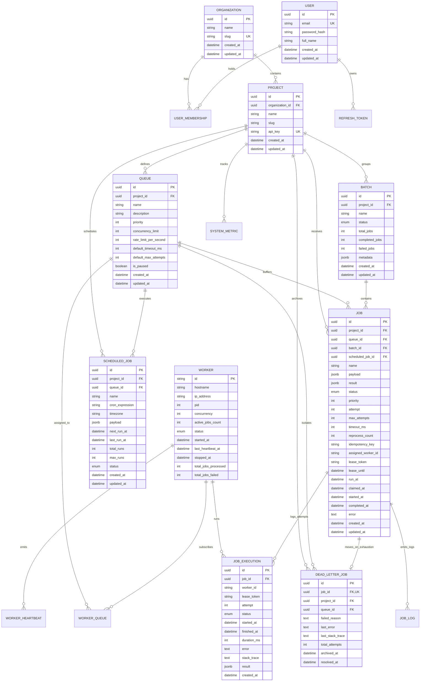

# Distributed Job Scheduler - Database Schema & ER Diagram

## Authoritative Relational Architecture

The Distributed Job Scheduler employs **PostgreSQL 16** as the strictly authoritative single source of truth for all job states, queues, workers, batches, and execution audit trails. **Redis 7** functions exclusively as an ephemeral coordination cache and Pub/Sub event bus.

---

## Entity Relationship Diagram (Mermaid)



---

## Critical PostgreSQL Indexes & Constraints

### 1. Partial Unique Index for Idempotency
```sql
CREATE UNIQUE INDEX uq_jobs_project_idempotency_key 
ON jobs(project_id, idempotency_key) 
WHERE idempotency_key IS NOT NULL;
```
*Guarantee*: Submissions with identical `(project_id, idempotency_key)` are atomically deduplicated, while standard jobs with `NULL` keys are unconstrained.

### 2. High-Performance Atomic Claim Index
```sql
CREATE INDEX idx_jobs_claim_runnable 
ON jobs(queue_id, status, run_at, priority DESC, created_at ASC);
```
*Guarantee*: Allows PostgreSQL `SELECT ... FOR UPDATE SKIP LOCKED` queries to evaluate runnable candidates with sub-millisecond index scans under high worker concurrency.

### 3. Expired Lease Crash Recovery Index
```sql
CREATE INDEX idx_jobs_expired_leases 
ON jobs(status, lease_until) 
WHERE status IN ('CLAIMED', 'RUNNING');
```
*Guarantee*: The Scheduler daemon scans expired leases in `O(log N)` time without full table scans.
