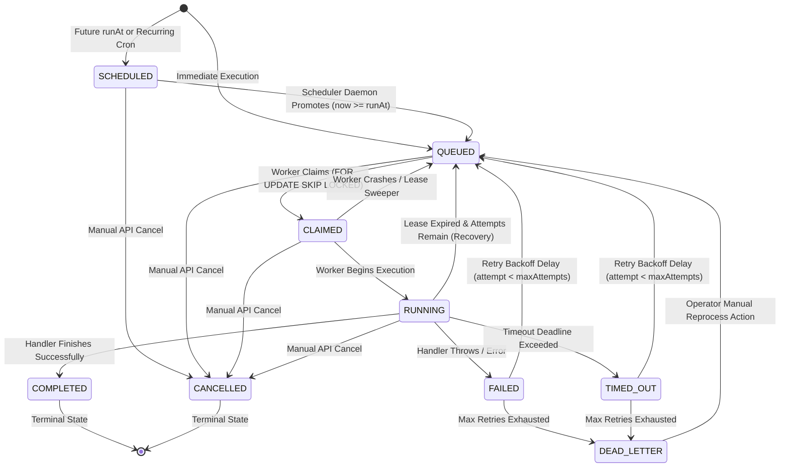

# Job Lifecycle State Machine & Lease Fencing Protocol

## Overview

The Distributed Job Scheduler implements an explicit, deterministic state machine with distributed lease fencing to guarantee:
1. **At-Least-Once Execution** with crash recovery.
2. **Zero Duplicate Concurrent Claims** via PostgreSQL `SELECT ... FOR UPDATE SKIP LOCKED`.
3. **Split-Brain Immunity** via cryptographic lease fencing tokens.
4. **Non-Destructive Auditability** via append-only execution histories and runtime logs.

---

## State Transition Diagram (Mermaid)



---

## State Transition Rules & Invariants

| State | Allowed Next States | Trigger / Mechanism | Fencing Token Action |
| :--- | :--- | :--- | :--- |
| **SCHEDULED** | `QUEUED`, `CANCELLED` | Scheduler daemon time check (`run_at <= NOW()`) | None |
| **QUEUED** | `CLAIMED`, `CANCELLED` | Worker atomic poll via `SKIP LOCKED` | Generates new `leaseToken` & sets `lease_until` |
| **CLAIMED** | `RUNNING`, `QUEUED`, `CANCELLED` | Worker spawns task handler | Token preserved |
| **RUNNING** | `COMPLETED`, `FAILED`, `TIMED_OUT`, `QUEUED`, `CANCELLED` | Handler result, timeout timer, or crash sweeper | Token checked on mutation (`WHERE lease_token = $token`) |
| **FAILED** | `QUEUED`, `DEAD_LETTER` | Retry Calculator delay vs Max Attempts | Cleared on requeue or DLQ move |
| **TIMED_OUT**| `QUEUED`, `DEAD_LETTER` | Execution watchdog timeout | Cleared on requeue or DLQ move |
| **DEAD_LETTER**| `QUEUED` | Manual reprocess button / API call | Cleared, reprocess count incremented |
| **COMPLETED**| *(None)* | **Terminal Immutable State** | Cannot be altered |
| **CANCELLED**| *(None)* | **Terminal Immutable State** | Cannot be altered |

---

## Distributed Lease Fencing Contract

To prevent split-brain execution when a worker node encounters a long garbage collection pause, network partition, or hung event loop:

1. **Token Generation on Claim**:
   Every atomic claim generates a unique UUID `leaseToken` written to the `jobs` row alongside `assigned_worker_id` and `lease_until = NOW() + leaseDurationMs`.
2. **Lease Extension**:
   While processing, the worker periodically sends heartbeat renewals:
   ```sql
   UPDATE jobs 
   SET lease_until = NOW() + INTERVAL '15 seconds'
   WHERE id = $jobId 
     AND assigned_worker_id = $workerId 
     AND lease_token = $leaseToken 
     AND status = 'RUNNING';
   ```
3. **Fencing Verification on Completion**:
   When the handler resolves, the worker updates the job with:
   ```sql
   UPDATE jobs 
   SET status = 'COMPLETED', result = $result, lease_until = NULL
   WHERE id = $jobId 
     AND assigned_worker_id = $workerId 
     AND lease_token = $leaseToken 
     AND status = 'RUNNING';
   ```
4. **Stale Worker Rejection**:
   If the worker lost its lease during a pause and the Scheduler Sweeper reset the job to `QUEUED` (where another worker claimed it with a new `leaseToken`), the stale worker's update matches **0 rows**. The stale worker detects this failure and safely aborts without overwriting newer job state.
