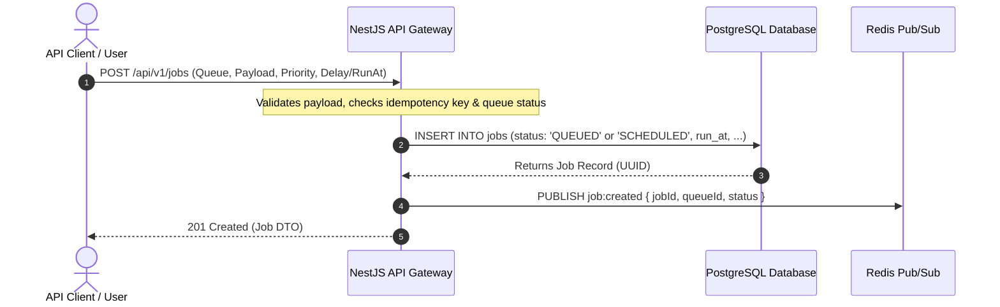
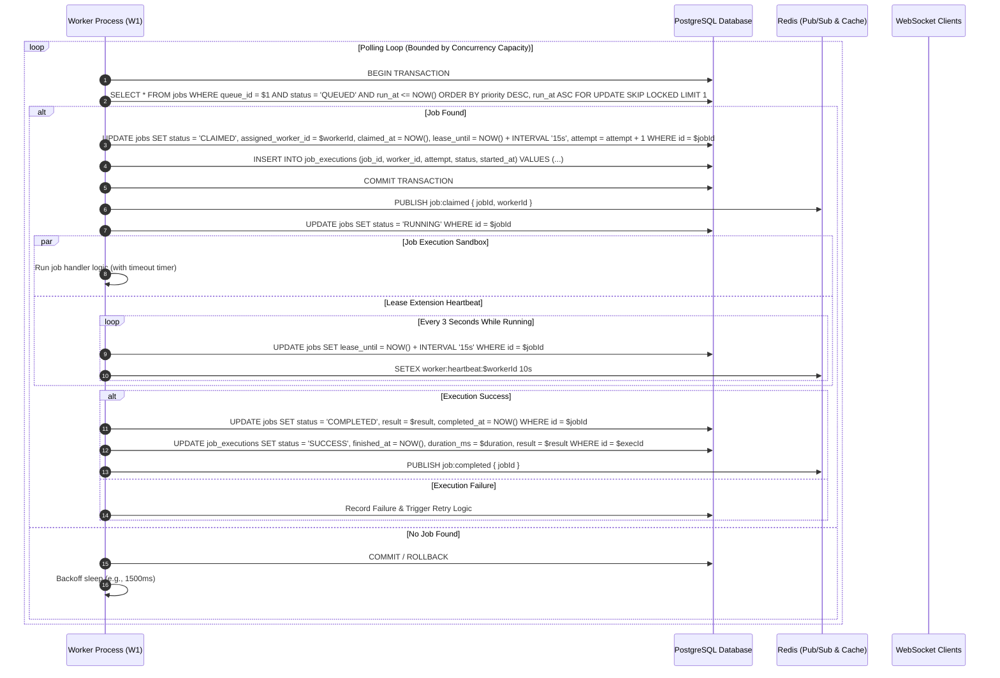
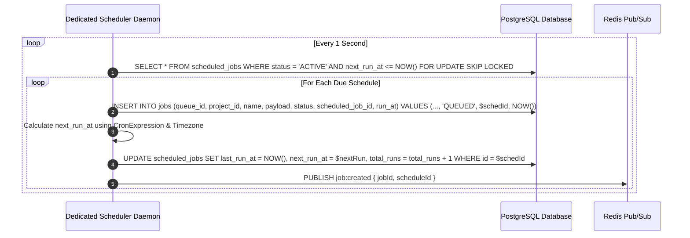

# End-to-End Data Flow

This document details the exact sequence of events and message interactions across the Distributed Job Scheduler.

---

## 1. Job Ingestion Flow (Immediate, Delayed, and Batch)



---

## 2. Atomic Job Claiming & Execution Flow



---

## 3. Scheduled & Recurring Cron Job Progression Flow



---

## 4. Crash Recovery & Expired Lease Reconciliation Flow

```mermaid
sequenceDiagram
    autonumber
    participant Sched as Scheduler Daemon / Sweeper
    participant DB as PostgreSQL Database
    participant W2 as Available Worker Node

    Note over Sched: Scans for abandoned jobs where workers crashed
    Sched->>DB: SELECT * FROM jobs WHERE status IN ('CLAIMED', 'RUNNING') AND lease_until < NOW() FOR UPDATE SKIP LOCKED
    loop For Each Expired Job
        alt attempt < max_attempts
            Sched->>DB: INSERT INTO job_logs (job_id, level, message) VALUES ($id, 'WARN', 'Worker lease expired; rescheduling job for retry.')
            Sched->>DB: UPDATE jobs SET status = 'QUEUED', assigned_worker_id = NULL, lease_until = NULL, run_at = NOW() WHERE id = $id
        else attempt >= max_attempts
            Sched->>DB: UPDATE jobs SET status = 'DEAD_LETTER' WHERE id = $id
            Sched->>DB: INSERT INTO dead_letter_jobs (job_id, failed_reason) VALUES ($id, 'Lease expired and max attempts exceeded')
        end
    end
    W2->>DB: Polls and atomically claims the recovered QUEUED job
```
