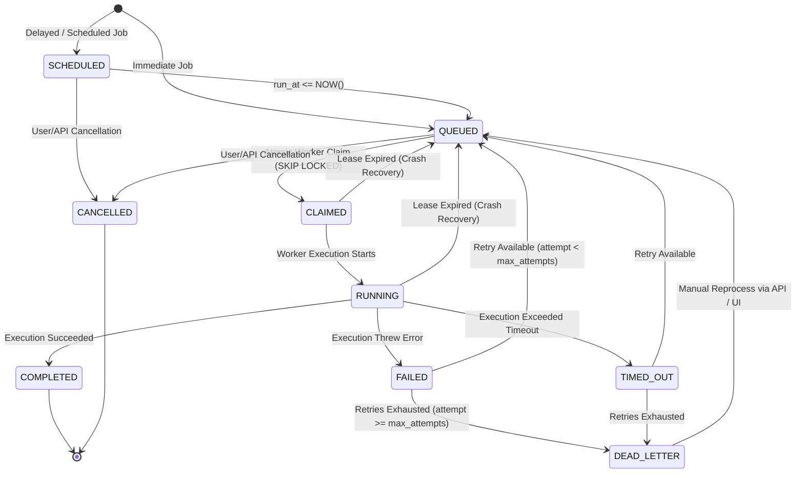

# Job Lifecycle & State Machine

## 1. State Machine Overview

The job lifecycle is governed by a deterministic, finite state machine enforced at both the database level (via SQL constraints and transactions) and application service layers. Arbitrary or invalid state transitions are strictly disallowed.

---

## 2. State Definitions & Invariants

| State | Description | Invariants & Requirements |
|---|---|---|
| `SCHEDULED` | Job is registered for future execution. | `run_at > NOW()`, `assigned_worker_id IS NULL`, `claimed_at IS NULL`. |
| `QUEUED` | Job is ready and eligible for immediate claiming by any active worker. | `run_at <= NOW()`, `assigned_worker_id IS NULL`, `lease_until IS NULL`. |
| `CLAIMED` | Atomically locked and assigned to a worker within a database transaction. | `assigned_worker_id IS NOT NULL`, `claimed_at IS NOT NULL`, `lease_until > NOW()`. |
| `RUNNING` | Active execution inside the worker runtime. | Worker is actively renewing `lease_until` every heartbeat interval. |
| `COMPLETED` | Execution completed without errors. | `completed_at IS NOT NULL`, `result IS NOT NULL`, `lease_until IS NULL`. Terminal state. |
| `FAILED` | Job attempt failed. Transient state before retry calculation. | `error IS NOT NULL`, execution history logged. |
| `DEAD_LETTER` | Max retry attempts reached or fatal non-retryable error encountered. | Copied/linked to `dead_letter_jobs` table for inspection. Terminal unless reprocessed. |
| `TIMED_OUT` | Execution surpassed `timeout_ms`. | Handled as a failure attempt. |
| `CANCELLED` | Manually cancelled by user before execution completes. | Terminal state. Worker halts if running. |

---

## 3. State Transition Rules Matrix

| From State | Allowed Target States | Trigger / Mechanism |
|---|---|---|
| `SCHEDULED` | `QUEUED`, `CANCELLED` | Scheduler tick (`run_at <= NOW()`) or User API cancel. |
| `QUEUED` | `CLAIMED`, `CANCELLED` | Worker `FOR UPDATE SKIP LOCKED` claim or User API cancel. |
| `CLAIMED` | `RUNNING`, `QUEUED` (Lease timeout), `CANCELLED` | Worker begins task handler or worker crashes before starting. |
| `RUNNING` | `COMPLETED`, `FAILED`, `TIMED_OUT`, `QUEUED` (Lease timeout), `CANCELLED` | Handler result, uncaught exception, timeout interrupt, or crash. |
| `FAILED` | `QUEUED` (if retries left), `DEAD_LETTER` (if attempts exhausted) | Backoff calculation updates `run_at` or archives to DLQ. |
| `TIMED_OUT` | `QUEUED` (if retries left), `DEAD_LETTER` (if attempts exhausted) | Backoff calculation or DLQ archive. |
| `DEAD_LETTER` | `QUEUED` | Manual reprocess action via REST API / UI. |
| `COMPLETED` | *None* | Final terminal state. |
| `CANCELLED` | *None* | Final terminal state. |
